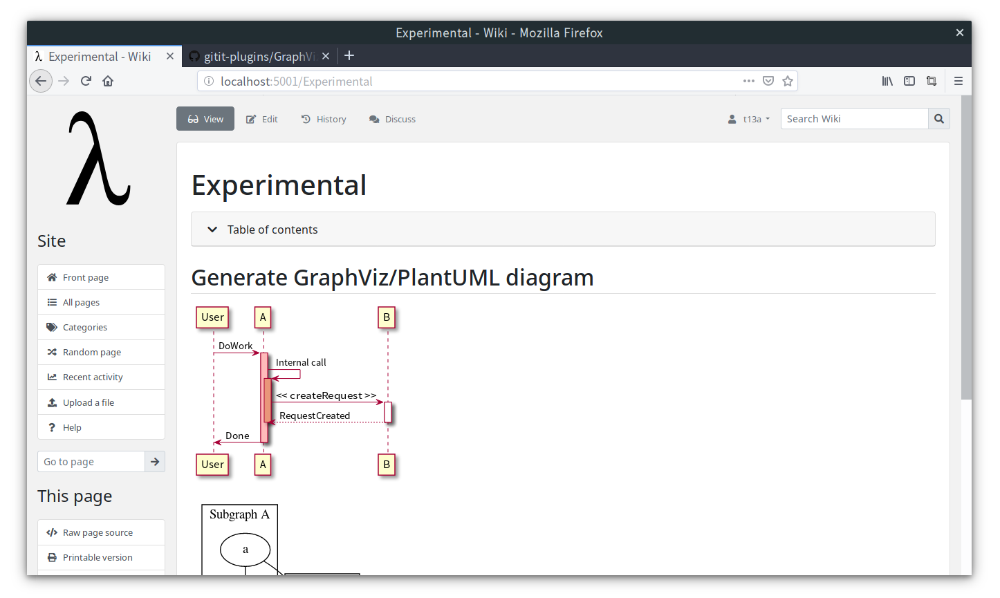

# Gitit Experimental



Dockerfile for [Gitit](https://github.com/jgm/gitit) with experimental features.

- [Bootstrap Theme](https://github.com/t13a/gitit-bootstrap-theme)
- [Generate GraphViz/PlantUML diagram](https://github.com/t13a/gitit-plugins)

## Getting started

```sh
$ docker run --rm -p 5001:5001 t13a/gitit-experimental
```

## Configuration

For details, please see [base container](https://github.com/t13a/dockerfile-gitit).

### Generate GraphViz/PlantUML diagram

By default, diagram generation is delegated to [public PlantUML server](http://www.plantuml.com/plantuml/). To use custom server, set URL to `PLANTUML_SERVER_URL` environment variable.

    $ docker run \
    ...
    -e PLANTUML_SERVER_URL=https://your-plantuml-server \
    ...
    t13a/gitit-experimental

This feature depends on `httplib2` module that uses own CA certificates where located in `/usr/local/lib/python2.7/dist-packages/httplib2/cacerts.txt`.  If you want to use system CA bundle, please specify path to `PLANTUML_CA_BUNDLE` environment variable.

    $ docker run \
    ...
    -e PLANTUML_CA_BUNDLE=/etc/ssl/certs/ca-certificates.crt \
    ...
    t13a/gitit-experimental
